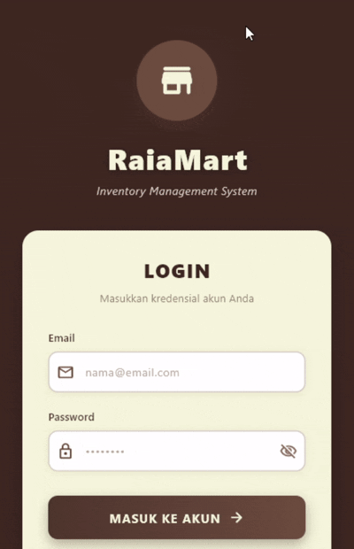

# Pemrograman Mobile - Responsi 2 Mobile Paket 3

## Identitas Mahasiswa
- **Nama**: Raia Digna Amanda
- **NIM**: H1D023061 
- **Shift Baru**: Shift C
- **Shift Asal**: Shift C

---

## 🎯 Deskripsi

Aplikasi Mobile **RaiaMart** adalah sistem manajemen inventaris buku yang dibangun menggunakan **Flutter**. Aplikasi ini memungkinkan pengguna untuk melakukan autentikasi (Login/Register) dan mengelola data buku (CRUD) yang terhubung dengan Backend API.

---

## 🛠️ Teknologi yang Digunakan

- **Framework**: Flutter
- **Language**: Dart
- **State Management**: Manual Bloc Pattern (StreamController & ValueNotifier)
- **Networking**: `http` package
- **Local Storage**: `shared_preferences` (untuk menyimpan token login)
- **UI Components**: Material Design 3

---
### Backend (CodeIgniter 4)
- **Framework**: CodeIgniter 4.6.3
- **PHP**: 8.3.16
- **Database**: MySQL
- **Server**: PHP Built-in Server

## 📂 Struktur Folder

```text
lib/
├── bloc/
│   ├── inventaris_bloc.dart # Logika bisnis untuk CRUD inventaris
│   ├── login_bloc.dart      # Logika bisnis untuk Login
│   ├── logout_bloc.dart     # Logika bisnis untuk Logout
│   └── registrasi_bloc.dart # Logika bisnis untuk Registrasi
├── helpers/
│   ├── api.dart             # Wrapper untuk HTTP request (GET, POST, PUT, DELETE)
│   ├── api_url.dart         # Konstanta URL Endpoint API
│   ├── app_exception.dart   # Custom Error Handling
│   └── user_info.dart       # Helper untuk SharedPreferences (Token & User Session)
├── model/
│   ├── inventaris.dart      # Model data untuk Inventaris Buku
│   ├── login.dart           # Model data untuk response Login
│   └── registrasi.dart      # Model data untuk payload Registrasi
├── ui/
│   ├── login_page.dart      # Halaman Login dengan animasi fade
│   ├── registrasi_page.dart # Halaman Registrasi User baru
│   ├── inventaris_page.dart # Halaman Utama (List Buku)
│   ├── inventaris_detail_page.dart # Halaman Detail Buku
│   └── inventaris_form_page.dart   # Halaman Tambah/Edit Buku
├── widgets/
│   ├── success_dialog.dart  # Widget dialog sukses custom
│   └── warning_dialog.dart  # Widget dialog peringatan custom
└── main.dart                # Entry point aplikasi
```
## Fitur Aplikasi
1. Autentikasi
- Login: User dapat masuk menggunakan email dan password. Token sesi disimpan secara lokal.
- Register: Pendaftaran akun baru dengan validasi input.
- Logout: Menghapus sesi lokal dan kembali ke halaman login.

2. Manajemen Inventaris (CRUD)
- List Data: Menampilkan daftar buku inventaris dari API.
- Detail Data: Melihat detail lengkap buku (Judul, Penulis, Harga, Stok, dll).
- Tambah Data: Form untuk menambahkan stok buku baru.
- Edit Data: Mengubah informasi buku yang sudah ada.
- Hapus Data: Menghapus buku dari inventaris dengan konfirmasi dialog.

## ⚙️ Konfigurasi API
Aplikasi ini terhubung ke backend melalui konfigurasi URL yang terdapat di lib/helpers/api_url.dart.

Base URL saat ini: http://192.168.100.64:8080

```Dart

static const String baseUrl = "[http://192.168.100.64:8080]";
```
Catatan: Pastikan IP address sesuai dengan IP komputer/server tempat backend berjalan agar aplikasi dapat terhubung, terutama jika dijalankan di Real Device.

## Demo Aplikasi
Berikut adalah demonstrasi penggunaan aplikasi RaiaMart:




## 🚀 Cara Menjalankan
1. Clone Repository
```bash
git clone <repository-url>
cd raiamart
```
2. Install Dependencies
```bash
flutter pub get
```
3. Sesuaikan IP API Buka lib/helpers/api_url.dart dan ubah baseUrl sesuai IP server backend Anda.
4. Jalankan Aplikasi
```bash
flutter run
```
